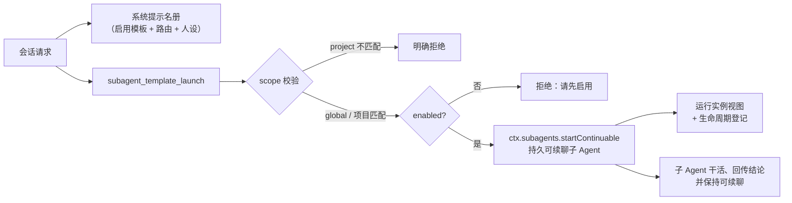

# dsh-subagent-manager

[English](README.md) | [简体中文](README-zh.md)

[](LICENSE)


**为 [DeepSeek Harness](https://github.com/deepseek-ai/deepseek-harness) 提供可复用的子 Agent 模板库。**
把每个专家定义一次——展示名、人设、模型路由、权限模式、深度上限——之后可以在任意会话里把它拉起为
持久、可续聊的子 Agent，限定到单个项目，或作为成员交给一个 Agent 小队。

## 为什么需要这个插件

子 agent 值得「定义一次、长期复用」，而不是在每条提示里重新描述一遍。

| 能力 | 给用户带来的价值 |
| --- | --- |
| 可复用模板 | 审查员 / 审计员 / 写作员 / 领域专家定义一次，跨项目跨对话复用 |
| 持久可续聊子 Agent | 拉起的子 Agent 有自己的可恢复会话，不是发完即弃 |
| 构造期安全策略 | 默认只读；全权限模板永远无法被启用 |
| 项目作用域 | `global` 或 `project:<id>`，拉起时二次校验；设置页隐藏其他项目的模板 |
| 名册注入 | 主模型始终能看到启用中的专家及其路由和人设 |
| 受管生命周期 | 编辑不打扰运行中的实例；停用只挡新拉起 |
| 乐观并发控制 | 多会话同时写会以 HTTP 409 明确冲突，而不是静默竞争 |
| 运行实例视图 + JSON 导入导出 | 查看、停止运行中的子 Agent；整个名册可导入导出 |

## 环境要求

- DeepSeek Harness `0.1.1` 通道（开发与验证基于 `0.1.1-rc.2`）
- **Web** profile
- Node.js `>=22.19.0 <23` 或 `>=24`
- 从源码构建时本机需要 TypeScript + tsdown（`npm i -g typescript@5.9.3 tsdown@0.22.2 lightningcss@1.33.0`，或本地安装）

## 安装

### 编译产物（推荐给 Web profile）

先构建一次，再注册本地目录：

```sh
git clone https://github.com/Wang-JQ77/dsh-subagent-manager.git
cd dsh-subagent-manager
tsc -p tsconfig.json && tsc -p tsconfig.client.json && tsdown
dsh plugin --profile web add -w .
dsh web     # 如果 Web 已在运行，重启进程
```

也可以使用 tarball：

```sh
npm pack --pack-destination dist
dsh plugin --profile web add -w ./dist/dsh-subagent-manager-<version>.tgz
```

### 校验组合结果

```sh
dsh --profile web --dump-config | Select-String subagent-manager
```

预期输出同时包含 `dsh-subagent-manager` bundle 层和 `subagent-manager` 插件行。

## 五步创建第一个子 Agent

1. 打开 **Settings → 子 Agent 管理**。首次运行会播种三个内置专家：
   `code-reviewer`、`security-auditor`、`doc-writer`。
2. 检查其中一个并打开 **已启用**，或点击 **新建模板**。表单里每个字段都有内联说明。
3. 在任意对话里让模型调用专家：
   「用 `code-reviewer` 审查 `function add(a,b){return a+b}`」。
4. 模型调用 `subagent_template_launch`；回答里会返回持久化的 `child_id` 和审查结论，
   实例同时出现在 **运行实例** 区块。
5. 之后随意管理：停用只挡新拉起；复制生成默认禁用的副本；归档移除模板；
   导出/导入用 JSON 移动整个名册。

## 一次拉起是怎么发生的



主模型回答时会读到注入的名册：要么直接驱动工具，要么配合 `agent_teams_*` 组队——
模板本身已经带好了 provider、model、强度与人设。

## 模板字段

| 字段 | 默认值 | 含义 |
| --- | --- | --- |
| `id` | —（必填） | 稳定 kebab-case 标识，实例跟踪与审计的 key |
| `name` | = `id` | 交给 agent-teams 的成员名 |
| `label` | —（必填） | 展示名 / 名册名，列表与系统提示名册使用它 |
| `role` | —（必填） | 角色描述 + 人设；拉起时作为子 Agent 的人设传入 |
| `provider` | `fork` | `fork` 继承调用方会话上下文，`spawn` 全新开始 |
| `model` | 部署默认 | 可选模型覆盖 |
| `reasoningEffort` | `medium` | `low` / `medium` / `high` |
| `permissionMode` | `readonly` | 只读 / 工作区 / 全权限（见安全策略） |
| `agentPreset` | `standard` | 原生能力组合：standard / code / minimal / creator |
| `memberProvider` | `fork` | 该模板加入小队时的成员生成方式 |
| `maxDepth` | `1` | 委托上限；`0` 禁止再委托 |
| `enabled` | `true` | 是否允许新拉起 |
| `tags` | `[]` | 自然语言匹配用的自由标签 |
| `scope` | `global` | `global`，或 `project:<目录名>` 限定到单个工作区 |
| `schemaVersion` | `1` | 向前兼容的记录版本 |

设置表单里每个字段的说明都是内联显示的（中英双语）。

## 安全策略与生命周期

- `permissionMode` 默认只读。
- 「全权限 + 启用」的组合在任何入口都会被拒绝（API 与表单一致）；选择 *full* 会自动取消启用勾选。
- 拉起前校验：已归档 / 已停用的模板拒绝拉起；project 模板在工作区不匹配时拒绝拉起。
- 生命周期约定：编辑只影响之后的拉起（运行中的子 Agent 保留启动快照）；停用只挡新拉起，
  不影响运行中实例；归档移除模板并报告受影响实例；副本一律以禁用状态创建。

## 作用域：global 与 project

`scope` 接受 `'global'`（默认）或 `'project:<目录名>'`。被限定的模板只允许从工作目录包含该
目录名的会话里拉起（整段路径段匹配：`my-app` 匹配 `C:/work/my-app/src`，不会误匹配
`my-app-2`）。设置页提供由实时会话 cwd 驱动的「仅当前项目」过滤，外项目的专家自动隐藏，
匹配中的专家一定可见。

## 配合小队

- 主模型收到注入的名册（启用模板含 provider / model / 人设 / 深度），像「组装审查员和审计员」
  这类自然语言请求无需重新描述任何人。
- **加入团队**动作会打印该模板现成的成员参数；真正的创建 / 加入 / 移除发生在会话内，通过
  [`agent_teams_*`](https://github.com/NanmiCoder/dsh-agent-teams) 工具完成，与
  [dsh-agent-team-gui](https://github.com/toolclub/dsh-agent-team-gui) 的成员用法一致。

## 模型工具

| 工具 | 用途 |
| --- | --- |
| `subagent_template_list` | 查看名册（可选 `id` 过滤） |
| `subagent_template_create` | 按参数定义模板（id/name/label/role/…） |
| `subagent_template_set_enabled` | 切换单个模板的新拉起许可 |
| `subagent_template_launch` | 把模板拉起为持久可续聊子 Agent |

## 客户端数据 API

设置页只和一个路由通信（`GET` 读、`POST` 写），所有变更都在宿主进程内完成：

| Action | 载荷 | 行为 |
| --- | --- | --- |
| `create` | 完整模板 | id 去重 + 应用安全策略 |
| `update` | `{ id, patch }` | 合并到当前记录 |
| `set_enabled` | `{ id, enabled }` | 在合并后的记录上强制执行安全策略 |
| `archive` | `{ id }` | 移除模板并报告受影响的运行实例 |
| `duplicate` | `{ id, newId? }` | 以禁用状态克隆到新 id |
| `join_team` | `{ id }` | 返回格式化后的成员参数 |
| `stop` | `{ childId }` | 清除一个运行实例 |

写入携带 `expectedRevision`；过期值返回 **HTTP 409 SETTINGS_CONFLICT**，两个打开的设置页不会互相覆盖。

## Host 配置

bundle 只插入一行；所有字段均可选。

```yaml
- id: subagent-manager
  name: dsh-subagent-manager
  config:
    storage: auto              # 自动探测 settings 命名空间
    memberProvider: fork       # 成员策略兜底
    memberMaxDepth: 1          # 委托深度兜底
    promptSectionOrder: 118    # 名册段落顺序
```

如果 profile patch 覆盖这一行，必须重写全部键——patch 会整体替换 `config` 对象，不做深合并。

## 持久化与并发

模板存放在 profile 的 settings 存储里（`~/.dsh/settings.yaml` 的 `subagent-manager:` 命名空间，
经 `dsh-settings` 写入），重启后保留，并用单调递增 revision 支持乐观并发。当 `dsh-settings`
不可用时，插件降级为内存存储并明确告警，绝不向别处散落文件。

## 开发

```sh
tsc -p tsconfig.json            # host program（类型 → lib/types）
tsc -p tsconfig.client.json     # client program
tsdown                          # 浏览器 bundle（lib/client.js）
node --test test/*.test.mjs     # 单元 + 服务端到端测试
node test/seed-settings.mjs     # 单独验证 settings 适配器上的播种逻辑
```

调研记录（原生重叠分析、环境坑位、实测日志）见
[`docs/M0-research.md`](docs/M0-research.md)。

## 对原生 `dsh-agent-presets` 的借鉴

本插件有意站在原生 presets 之上，而不是和它们对立：

- **内置起始集播种** —— 空库时交付三个内置模板，正对应原生 presets 在第一天就给出
  `standard / code / minimal / creator` 的做法。
- **按名字引用预设** —— 模板的 `agentPreset` 直接指向原生能力组合，原生侧的编排持续进化，
  本插件保持轻量。
- **随 profile 持久化** —— 把名册放进 settings 命名空间，遵循原生组件的持久化方式，
  而不是再造一个存储根。
- **service-key 特性探测** —— 双键 `webServer`/`httpServer` 探测与延迟注册模式，
  直接借鉴自原生 bundle 的兼容性打法。

两者位于不同轴线：`dsh-agent-presets` 决定某个会话以什么组合运行；本插件管理可复用的子 Agent。
因为遵循同一套约定，混用起来像一个工具箱。

## 致谢

- [NanmiCoder/dsh-agent-teams](https://github.com/NanmiCoder/dsh-agent-teams) —— captain/member
  模型、插件开发 Skill，以及本项目所参考的脚手架。
- [toolclub/dsh-agent-team-gui](https://github.com/toolclub/dsh-agent-team-gui) —— 小队编排；
  用这些模板配上它即可组成完整的「定义 + 执行」栈。
- [lyh9712/dsh-bg-image](https://github.com/lyh9712/dsh-bg-image) —— Web profile 客户端
  bundle 约定的参考实现。

## 许可

[MIT](LICENSE)
