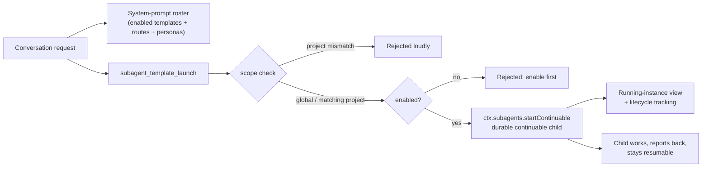

# dsh-subagent-manager

[English](README.md) | [简体中文](README-zh.md)

[](LICENSE)


**Reusable sub-agent templates for [DeepSeek Harness](https://github.com/deepseek-ai/deepseek-harness).**
Define each specialist once — display name, persona, model route, permission mode, depth cap —
then launch it as a durable, continuable sub-agent from any conversation, pin it to a single
project, or hand it to an Agent-Teams squad as a member.

## Why this plugin

A sub-agent is worth defining once, as a product object, instead of re-describing it in every
prompt.

| Capability | User outcome |
| --- | --- |
| Reusable templates | Define a reviewer, auditor, writer, or domain expert once; reuse across conversations and projects |
| Durable continuable children | Launched agents keep their own resumable session instead of being fire-and-forget |
| Safety policy by construction | Read-only permission by default; a full-permission template can never be enabled |
| Project scoping | `global` or `project:<id>`, re-checked at launch; the settings page hides foreign projects |
| Roster injection | The lead model always sees enabled specialists together with their routes and personas |
| Managed lifecycle | Editing never disturbs running instances; disabling only blocks new launches |
| Optimistic concurrency | Multi-session writes conflict loudly with HTTP 409 instead of silently racing |
| Instance view + JSON port | See and stop live children; export/import the whole roster |

## Install

> **No build step needed.** This repository ships prebuilt output in `lib/` (the same convention
> as [lyh9712/dsh-bg-image](https://github.com/lyh9712/dsh-bg-image)), and the package declares no
> install-time build scripts, so a plain git/tarball install works.

### Requirements

- DeepSeek Harness on the `0.1.1` channel (developed and verified against `0.1.1-rc.2`)
- The **Web** profile
- Node.js `>=22.19.0 <23` or `>=24` (same range as DSH itself)

### Option 1 — install straight from GitHub (one command)

```sh
dsh plugin --profile web add -w github:Wang-JQ77/dsh-subagent-manager
```

For reproducibility, pin a tag or full commit instead of the branch tip:

```sh
dsh plugin --profile web add -w github:Wang-JQ77/dsh-subagent-manager#v0.1.0
```

### Option 2 — install from a release tarball

Download the latest `.tgz` from [GitHub Releases](https://github.com/Wang-JQ77/dsh-subagent-manager/releases),
then:

```sh
dsh plugin --profile web add -w ./dsh-subagent-manager-0.1.0.tgz
```

A tarball avoids git entirely — no git binary and no pnpm build approval needed.

### Option 3 — from source (contributors)

```sh
git clone https://github.com/Wang-JQ77/dsh-subagent-manager.git
cd dsh-subagent-manager
# rebuild only if you changed sources (lib/ is committed and already current)
npm i -g typescript@5.9.3 tsdown@0.22.2 lightningcss@1.33.0   # or use local installs
tsc -p tsconfig.json && tsc -p tsconfig.client.json && tsdown
dsh plugin --profile web add -w .
```

> [!IMPORTANT]
> Framework packages (`@deepseek-ai/dsh-*`) are **not** something you install separately — the DSH
> CLI ships them inside its own bundle, and the plugin resolves them from there at runtime.
> If `pnpm` ≥ 10 asks for build approval during `add`, **you do not need to allow anything**:
> this package has no build scripts.

### Verify the composed bundle

```sh
dsh --profile web --dump-config | Select-String subagent-manager
```

Expected output contains both the `dsh-subagent-manager` bundle layer and the `subagent-manager`
row with its `config:` block.

### After installing

- **Restart the Web process** — an already-running Web instance keeps the old composition until it
  is restarted (`dsh web` or restart the running process).
- Open **Settings → 子 Agent 管理**. Three starter templates are seeded on first run.

### Troubleshooting

- **Nothing shows in `dump-config`** — re-run `dsh plugin --profile web install` to reconcile
  dependencies, then `dump-config` again. The profile must list the package in its dependencies.
- **The settings page is there but the model says it has no `subagent_template_*` tools** — start
  a *new* session: the tool catalog is captured per session. Also note that presets with a
  minimal bootstrap (e.g. `liangshen`) expose only two tools until the first turn completes;
  the full catalog appears afterwards.
- **Templates disappeared after a restart** — you are running an old build that predates the
  settings-persistence fix. Update to the latest release and reinstall.
- **The "打开配置文件" button in the settings page does nothing** — that is the DSH shell's own
  button, not this plugin's; associate `.yaml`/`.yml` with an editor on your system.

## Your first sub-agent in five steps

1. Open **Settings → 子 Agent 管理 (Sub-agent Manager)**. Three starter specialists
   (`code-reviewer`, `security-auditor`, `doc-writer`) are seeded on first run.
2. Review one and flip **Enabled**, or press **Create template**. Every field carries an
   inline hint explaining what it controls.
3. In any conversation, ask the model to use a specialist:
   “Use `code-reviewer` to review `function add(a,b){return a+b}`.”
4. The model calls `subagent_template_launch`; the answer returns a durable `child_id` and the
   review result, and the instance appears under **Running instances**.
5. Manage freely afterwards: disable blocks future launches only, duplicate clones a template
   disabled, archive removes it, Export/Import move the whole roster as JSON.

## How a launch works



When the lead model answers, it reads the injected roster and either drives the tools directly or
builds a squad with `agent_teams_*`; a template becomes a member whose definition already carries
the right provider, model, effort, and persona.

## Template fields

| Field | Default | Meaning |
| --- | --- | --- |
| `id` | — (required) | Stable kebab-case key used by instance tracking and audits |
| `name` | = `id` | Member name handed to agent-teams |
| `label` | — (required) | Display / roster name shown in lists and the prompt roster |
| `role` | — (required) | Role description + persona; sent to the child as its persona |
| `provider` | `fork` | `fork` inherits the calling session context, `spawn` starts clean |
| `model` | deployment default | Optional model override |
| `reasoningEffort` | `medium` | `low` / `medium` / `high` |
| `permissionMode` | `readonly` | `readonly` / `workspace` / `full` (see safety policy) |
| `agentPreset` | `standard` | Native capability combo: standard / code / minimal / creator |
| `memberProvider` | `fork` | Strategy used when the template joins an agent-teams squad |
| `maxDepth` | `1` | Delegation cap; `0` forbids delegation |
| `enabled` | `true` | Whether new launches are allowed |
| `tags` | `[]` | Free-form tags for natural-language matching |
| `scope` | `global` | `global`, or `project:<dir-name>` restricted to one workspace |
| `schemaVersion` | `1` | Forward-compatible record version |

Every field shows its hint inline in the settings form (English and Chinese).

## Safety policy and lifecycle

- `permissionMode` defaults to `readonly`.
- `"full"` + `enabled` is refused everywhere (API and form); selecting *full* auto-clears the
  enabled checkbox.
- Launch-time gates: an archived/disabled template refuses to launch, and a project-scoped
  template refuses to launch outside its workspace.
- Lifecycle contract: editing affects only future launches (children keep their launch snapshot);
  disabling blocks new launches without touching running ones; archiving removes the template and
  reports affected children; duplicates are always created disabled.

## Scope: global vs project

`scope` accepts `'global'` (default) or `'project:<dir-name>'`. A scoped template may only be
launched from a session whose working directory contains that directory name as a whole path
segment (`my-app` matches `C:/work/my-app/src`, never `my-app-2`). The settings page offers an
“only current project” filter fed by the live session cwd, so foreign specialists stay out of
sight while a matching one is guaranteed to appear.

## Working with squads

### Overview

dsh-subagent-manager and [dsh-agent-teams](https://github.com/NanmiCoder/dsh-agent-teams) form a
**define + execute** stack. The subagent-manager owns the template registry (definition layer);
agent-teams owns the multi-agent orchestration (execution layer). They work together through
two integration points: **roster injection** and **member parameter generation**.

```
┌─ dsh-subagent-manager (definition layer) ──────────────────────────┐
│  Template Registry ──→ memberParams()  ──→ ready-made member       │
│  Roster injection  ──→ system prompt   ──→ captain sees templates  │
└────────────────────────────────────────────────────────────────────┘
                            │
                            ▼
┌─ dsh-agent-teams (execution layer) ────────────────────────────────┐
│  agent_teams_create / agent_teams_add_member                       │
│       → resolveMemberLlmSelection()  → validate & resolve route    │
│       → spawnMember()                → ctx.subagents.startContinuable│
│       → durable subagent with template persona                     │
└────────────────────────────────────────────────────────────────────┘
```

### How they collaborate

1. **Roster awareness** — The captain model receives a system prompt section named
   `subagent-manager:roster` listing every enabled template with its provider, model, role,
   permission mode, and member provider. This is injected by `buildRosterText()` in
   `src/roster.ts`. Natural-language requests like "assemble code-reviewer and security-auditor"
   resolve without re-describing anyone.

2. **Template → member parameters** — The settings page **Join a team** action calls
   `memberParams(templateId)` in `src/service.ts`, which extracts the template's `provider`,
   `model`, `persona` (role), and `reasoningEffort` as a ready-made member descriptor. The
   descriptor carries `agentTeams: true` so agent-teams knows it is a template-backed member.

3. **Team creation** — The captain uses `agent_teams_create(profile=...)` to build a new team
   where the profile's `members` array draws directly from template fields:
   - `name` ← template's `name` (or the `memberProvider` strategy)
   - `role` ← template's `role` (becomes the member's persona)
   - `provider` ← template's `provider`
   - `model` ← template's `model`
   - `reasoningEffort` ← template's `reasoningEffort`
   - `executionPrompt` ← template's `description` (optional)

   Alternatively, the captain can add a template-based member to an existing team with
   `agent_teams_add_member(name, role, provider, model, ...)`.

4. **Route resolution** — For each member, agent-teams calls `resolveMemberLlmSelection()` to
   validate the provider/model combination against the LLM catalog, apply fallback chains, and
   confirm the subagent provider supports continuable sessions with persona injection.

5. **Member spawning** — `spawnMember()` in agent-teams calls `ctx.subagents.startContinuable()`
   with the template's persona, tool filter (denying captain-only tools), and LLM route. The
   member is created as a durable continuable subagent whose conversation can be resumed later.

6. **Task orchestration** — Members work independently on their assigned tasks, report back to
   the captain, and the captain decides when the team goal is complete. Members can communicate
   with each other through agent-teams' direct messaging feature.

### Complete workflow example

```
1. Create templates in Settings → Sub-agent Manager:
   ┌──────────────────────┬────────────┬──────────────────────────────┐
   │ Template             │ provider   │ role                         │
   ├──────────────────────┼────────────┼──────────────────────────────┤
   │ code-reviewer        │ fork       │ "Code review specialist"     │
   │ security-auditor     │ fork       │ "Security audit specialist"  │
   │ doc-writer           │ fork       │ "Technical documentation"    │
   └──────────────────────┴────────────┴──────────────────────────────┘

2. In a conversation, ask the model:
   "Create a team with code-reviewer and security-auditor to review PR #42."

3. The captain reads the roster and calls:
   agent_teams_create(profile={
     members: [
       {name: "code-reviewer", provider: "fork", role: "Code review specialist"},
       {name: "security-auditor", provider: "fork", role: "Security audit specialist"}
     ],
     tasks: [
       {id: "review", subject: "Review PR #42", assignee: "code-reviewer"},
       {id: "audit", subject: "Security audit the changes", assignee: "security-auditor"}
     ]
   })

4. agent-teams validates each member's route, creates the team directory, and spawns each
   member as a continuable subagent. The review tasks are assigned automatically.

5. Members work independently. The code reviewer inspects the diff, the security auditor
   checks for vulnerabilities. Both report back to the captain.

6. The captain aggregates the results and presents the final review summary.
```

### From the settings page

The **Join a team** button in the template editor prints the member's formatted parameters
directly. The actual create/join/remove happens in-session through the
[`agent_teams_*`](https://github.com/NanmiCoder/dsh-agent-teams) tools, exactly like
[dsh-agent-team-gui](https://github.com/toolclub/dsh-agent-team-gui) members.

### Template design tips for team use

| Tip | Why |
| --- | --- |
| Keep `role` self-contained | It becomes the member's persona — include domain, tone, and constraints |
| Set `reasoningEffort` explicitly | High for audit/analysis tasks, low for quick lookups |
| Use `tags` for matching | Helps the captain match templates to natural-language requests |
| Scope `project:` templates | Restrict team members to sessions in the matching workspace |
| Leave `memberProvider` as `fork` | Inherits session context so members share the captain's tools |
| Set `description` as execution guidance | It becomes the member's `executionPrompt` in agent-teams |

## Model tools

| Tool | Purpose |
| --- | --- |
| `subagent_template_list` | Inspect the roster (optional `id` filter) |
| `subagent_template_create` | Define a template from parameters (id/name/label/role/…) |
| `subagent_template_set_enabled` | Toggle new-launch permission for one template |
| `subagent_template_launch` | Launch a template as a durable continuable child |

## Client data API

The settings page talks to one route (`GET` reads, `POST` writes), so every mutation runs inside
the host process:

| Action | Payload | Behaviour |
| --- | --- | --- |
| `create` | full template | Deduplicates ids, applies the safety policy |
| `update` | `{ id, patch }` | Merges onto the current record |
| `set_enabled` | `{ id, enabled }` | Enforces the policy on the merged record |
| `archive` | `{ id }` | Removes the template and reports affected children |
| `duplicate` | `{ id, newId? }` | Clones disabled under a new id |
| `join_team` | `{ id }` | Returns formatted member parameters |
| `stop` | `{ childId }` | Clears one running instance |

Writes carry `expectedRevision`; a stale value yields **HTTP 409 SETTINGS_CONFLICT** so two open
settings pages cannot race.

## Host configuration

The bundle inserts one row; every field is optional.

```yaml
- id: subagent-manager
  name: dsh-subagent-manager
  config:
    storage: auto              # feature-detected settings namespace
    memberProvider: fork       # fallback member strategy
    memberMaxDepth: 1          # fallback delegation cap
    promptSectionOrder: 118    # roster section order
```

A profile patch replaces the whole `config` object — rewrite all needed keys if you override it.

## Persistence and concurrency

Templates live in the profile's settings store (`~/.dsh/settings.yaml` under the
`subagent-manager:` namespace) through `dsh-settings`, survive restarts, and carry a monotonic
revision used for optimistic concurrency. When `dsh-settings` is unavailable the plugin degrades
to an in-memory store and warns instead of scattering files.

## Development

```sh
tsc -p tsconfig.json            # host program (types → lib/types)
tsc -p tsconfig.client.json     # client program
tsdown                          # browser bundle (lib/client.js)
node --test test/*.test.mjs     # unit + end-to-end service tests
node test/seed-settings.mjs     # isolates seeding through the settings adapter
```

Research notes (native-overlap investigation, environment pitfalls, live test log) live in
[`docs/M0-research.md`](docs/M0-research.md).

## Borrowed from native `dsh-agent-presets`

This plugin leans on the native presets deliberately rather than fighting them:

- **Starter set seeding** — shipping three built-in templates on an empty store mirrors how
  native presets deliver `standard / code / minimal / creator` on day one.
- **Preset references by name** — a template's `agentPreset` points straight at the native
  capability combos, so composition keeps improving natively while this plugin stays thin.
- **Profile-scoped persistence** — storing the roster in the settings namespace follows the way
  native pieces persist theirs instead of inventing another storage root.
- **Service-key feature detection** — the dual-key `webServer`/`httpServer` probe and lazy
  registration patterns come straight from the native bundles' compatibility playbook.

They sit on different axes: `dsh-agent-presets` decides what composition a session runs with;
this plugin manages reusable sub-agents. Because both follow the same conventions, mixing them
feels like one toolkit.

## Acknowledgements

- [NanmiCoder/dsh-agent-teams](https://github.com/NanmiCoder/dsh-agent-teams) — captain/member
  model, the plugin-development skill, and the scaffold this project was built against.
- [toolclub/dsh-agent-team-gui](https://github.com/toolclub/dsh-agent-team-gui) — squad
  orchestration; pair it with these templates for a full definition-plus-execution stack.
- [lyh9712/dsh-bg-image](https://github.com/lyh9712/dsh-bg-image) — reference for the Web-profile
  client-bundle conventions.

## License

[MIT](LICENSE)
